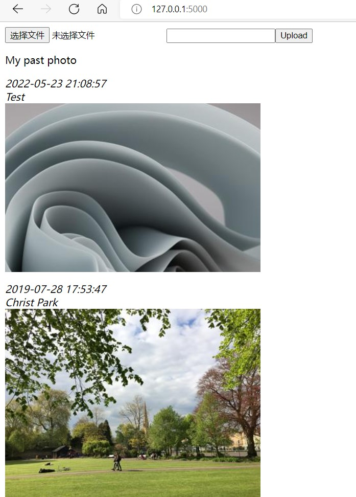

Lab 2 Handout: Using Blueprints to Architect A Photo Album Web Application   
===================================

Introduction
------------------------

成员信息：

[刘奕秀]- 201931990209 - 1978933929@qq.com (TECH LEAD)

[李敏]- 201931990403 - 2609891867@qq.com

[吴佩媛]- 201931990410 - 29723741292@qq.com

  
- 下载Photo String的源代码并运行。

- 绘制以下蓝图：upload_bp, show_bp, search_bp, and api_bp

- 将上述蓝图注册到web应用程序。

- upload_bp允许上传新照片，关联的路由为/upload。

- show_bp允许按时间顺序显示所有照片及其描述,关联的路由为/show。

- search_bp允许根据照片描述过滤照片，关联的路由为/search/query-string（返回描述与查询字符串匹配的照片作为搜索结果）。

- api_bp允许从命令行获取JSON格式的所有照片信息，关联的路由是/api/json（返回的json字符串必须包含每张照片的照片ID、上载日期、照片大小（KB）和照片描述）。

- 添加新功能

Materials and Methods
------------------------

工具
~~~~~~~~~~~~~~~~~~~~~~~~~~~~~~~~

- **blueprint**：蓝图是应用中可以作为子路由的对象。蓝图定义了同样的添加路由的方式，可以将一系列路由注册到蓝图上而不是直接注册到应用上，然后再以可插拔的方式将蓝图注册到到应用程序。

方法
~~~~~~~~~~~~~~~~~~~~~~~~~~~~~~~~

使用blueprint的方法

https://www.imooc.com/wiki/flasklesson/blueprint.html

Results
-------------

Photo String 的运行
~~~~~~~~~~~~~~~~~~~~~~~~~~~~~~~~

upload_bp.py
~~~~~~~~~~~~~~~~~~~~~~~~~~~~~~~~

.. code-block:: python

   from flask import Blueprint,request 
   from UseSqlite import InsertQuery
   from datetime import datetime

   upload_bp = Blueprint('upload_bp', __name__, url_prefix = '/upload', 
   template_folder = 'templates', static_folder = 'static')

   @upload_bp.route("/",methods = ['POST','GET'])
   def upload():
       if request.method == 'POST':
              uploaded_file = request.files['file']
              time_str = datetime.now().strftime('%Y%m%d%H%M%S')
              new_filename = time_str + '.jpg'
              uploaded_file.save('./static/upload/' + new_filename)
              time_info = datetime.now().strftime('%Y-%m-%d %H:%M:%S')
              description = request.form['description']
              path = './static/upload/' + new_filename
              iq = InsertQuery('./static/RiskDB.db')
              iq.instructions("INSERT INTO photo Values('%s','%s','%s','%s')" % 
              (time_info, description, path, new_filename))
              iq.do()
           return '
You have uploaded %s.  <a href="/">Return</a>.' % 
           (uploaded_file.filename)
       else:
           page = '''<form action = "http://127.0.0.1:5000/upload/" method = "post" 
           enctype = "multipart/form-data">
                 <input type = "file"name = "file"><input name = "description"><input type
                 = "submit" value = "Upload"> </form>'''
           r = "SELECT * FROM photo ORDER By time desc"
           return page
           
.. image:: ../upload_bp1.png
   :align: center
   :alt: upload_bp1运行图     
              
.. image:: ../upload_bp2.png
   :align: center
   :alt: upload_bp2运行图    
    
show_bp.py  
~~~~~~~~~~~~~~~~~~~~~~~~~~~~~~~~
.. code-block:: python

   from flask import Blueprint
   from utils import get_database_photos

   show_bp = Blueprint('show_bp', __name__, url_prefix = '/show',
   template_folder = 'templates', static_folder = 'static')

   @show_bp.route("/")
   def search():
       r = "SELECT * FROM photo ORDER By time desc"
       return get_database_photos(r)

           
.. image:: ../show_bp.png
   :align: center
   :alt: show_bp运行图    

search_bp.py
~~~~~~~~~~~~~~~~~~~~~~~~~~~~~~~~
.. code-block:: python

   from flask import Blueprint
   from utils import get_database_photos

   search_bp = Blueprint('search_bp', __name__, url_prefix = '/search',
   template_folder = 'templates', static_folder = 'static')
    
   @search_bp.route("/<name>/")
   def search(name):
       r = "SELECT * FROM photo WHERE  description  LIKE '%"+name+"%' ORDER By time desc"
       return get_database_photos(r)
           
.. image:: ../search_bp.png
   :align: center
   :alt: search_bp运行图    
   
api_bp.py
~~~~~~~~~~~~~~~~~~~~~~~~~~~~~~~~
.. code-block:: python

   import json
   from flask import Blueprint
   from UseSqlite import RiskQuery

   api_bp = Blueprint('api_bp', __name__, url_prefix = '/api',
   template_folder = 'templates',static_folder='static')

   @api_bp.route('/json',methods=['POST','GET'])
   def getlist():
       rq = RiskQuery('./static/RiskDB.db')
       rq.instructions("SELECT * FROM photo ORDER By time desc")
       rq.do()
       json_data = {}
       id = 1       
       for r in rq.format_results().split('\n\n'):
           img = {}
           if r.strip()=='':
               break
           lst=r.split(',')
           picture_time = lst[0].strip()
           picture_description = lst[1].strip()
           picture_path=lst[2].strip()
           picture_name=lst[3].strip()
           img['picture_time'] = picture_time
           img['picture_description'] = picture_description
           img['picture_name'] = picture_name
              img['picture_path'] = picture_path
           json_data[str(id)] = img
           id = id+1
       str1 = json.dumps(json_data)
       jsonToPhoto = json.loads(str1)
       return jsonToPhoto
           
.. image:: ../api_bp.png
   :align: center
   :alt: api_bp运行图    

添加新功能[音乐播放器]
~~~~~~~~~~~~~~~~~~~~~~~~~~~~~~~~

References
-------------
[1] `blueprints <http://exploreflask.com/en/latest/blueprints.html/>`_
